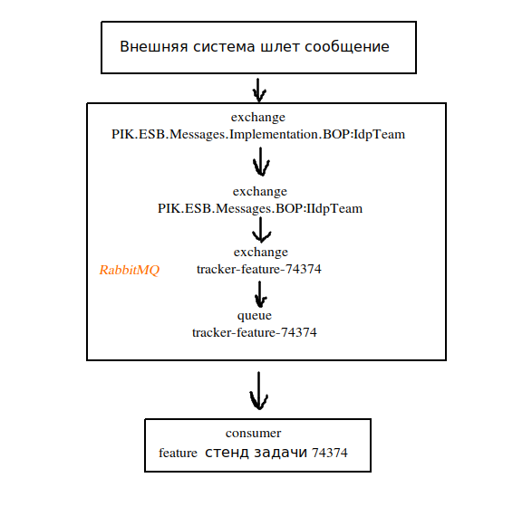

## MassTransit и RabbitMQ

MassTransit и RabbitMQ используются для интеграции с другими системами ПИК. Наша система принимает и/или отправляет
сообщения.

Содержание:

* [Адреса RabbitMQ](#rabbitmq-addresses)
* [Получение сообщения от внешней системы](#получение-сообщения-от-внешней-системы)
* [Схемы получения сообщения](#схемы-получения-сообщения)
* [Примеры сообщений, которые получает ТН](#input-messages)
* [Примеры сообщений, которые отправляет ТН](#output-messages)
* [Технические детали MassTransit и RabbitMQ в ТехНадзоре](#mt-technical-info)
* [Консольная команда для публикации](#masstransit-publish)
* [Консольная команда для прослушивания](#masstransit-consume)
* [Все возможные слушатели](#все-возможные-слушатели)
* [Отслеживание процесса публикации и получения сообщений](#отслеживание-процесса-публикации-и-получения-сообщений)
* [Настройка MassTransit и RabbitMQ на стендах](#stands-settings)
* [FAQ](#faq)

### Адреса RabbitMQ <a id="rabbitmq-addresses"/>

| RabbitMQ для feature стендов | RabbitMQ для test стенда | RabbitMQ для prod |
| --- | --- | --- |
| https://rabbit.dev.svc.pik-digital.ru/#/ | https://rabbit.test.svc.pik-digital.ru/#/| https://rabbit.svc.pik-digital.ru/#/ |

### Получение сообщения от внешней системы

1. Внешняя система шлет сообщение в RabbitMQ:

<details>
  <summary>Пример сообщения</summary>

```json
{
  "messageSendDate": "2021-09-28T15:28:12.0516079+03:00",
  "messageId": "6e35282e-533a-43ac-ac2b-be085377d754",
  "messageDateTimeUtc": "2021-09-28T12:28:12.0516089Z",
  "messageUniqueId": "6e35282e-533a-43ac-ac2b-be085377d754",
  "batchMessageTotal": 1,
  "batchMessageNumber": 1,
  "processUniqueId": "65c71179-0bdf-4c51-8389-961b36d5c344",
  "destinationAddress": "rabbitmq://test.ru/pik/PIK.ESB.Messages.Implementation.BOP:IdpTeam",
  "messageType": [
    "urn:message:PIK.ESB.Messages.Implementation.BOP:IdpTeam",
    "urn:message:PIK.ESB.Messages.BOP:IIdpTeam",
    "urn:message:PIK.ESB.Messages.Implementation:Message",
    "urn:message:PIK.ESB.Messages:IMessage"
  ],
  "message": {
    "id": 37035,
    "guid": "ff483d42-a045-4eb8-a2ba-99a4b6e07d28",
    "objectId": 14659,
    "livingComplexId": 77,
    "roleId": 39,
    "employeeId": 23890,
    "employeeGuid": "71345723-99b7-11e6-aa10-001ec9d8cb21",
    "globalId": "7552f2a8-e52e-4540-9b09-855000b92482",
    "status": "Утверждено",
    "dateStart": "2021-09-25T00:00:00",
    "individualId": 23657,
    "created": "2021-09-28T15:28:12.033",
    "modified": "2021-09-28T15:28:12.033",
    "bopId": "3cef3fc8-edd2-40de-9831-5a2e521c2b39",
    "messageSendDate": "2021-09-28T15:28:12.0516079+03:00",
    "messageId": "6e35282e-533a-43ac-ac2b-be085377d754",
    "messageDateTimeUtc": "2021-09-28T12:28:12.0516089Z",
    "messageUniqueId": "6e35282e-533a-43ac-ac2b-be085377d754",
    "batchMessageTotal": 1,
    "batchMessageNumber": 1,
    "processUniqueId": "65c71179-0bdf-4c51-8389-961b36d5c344"
  }
}
```

</details>

2. Автоматически создаются exchange c названиями `PIK.ESB.Messages.Implementation.BOP:IdpTeam`
   и `PIK.ESB.Messages.BOP:IIdpTeam`, которые связаны друг с другом. Названия exchange можно найти в сообщении в
   поле `messageType`.

3. Сообщение шлется в exchange с названием `PIK.ESB.Messages.Implementation.BOP:IdpTeam`. Список exchange находится во
   вкладке `Exchanges` [https://rabbit.dev.svc.pik-digital.ru/#/exchanges](https://rabbit.dev.svc.pik-digital.ru/#/exchanges):


Чтобы найти exchange, нужно в поле `Filter` ввести полное название или его часть, к примеру `IdpTeam`:


4. Сообщение из `PIK.ESB.Messages.Implementation.BOP:IdpTeam` попадает в `PIK.ESB.Messages.BOP:IIdpTeam`, тк они
   связаны. Посмотреть связь можно на странице первого exchange, для этого надо тыкнуть на его название в табличке:


Связи можно посмотреть в `Bindings`:


После чего тыкнуть на `PIK.ESB.Messages.BOP:IIdpTeam`:


5. Далее, сообщение из `PIK.ESB.Messages.BOP:IIdpTeam` попадает во все связанные с ней дальше exchange, которые связаны
   с очередями (queue):


К примеру exchange `tracker-feature-74374` связан с очередью (queue), которая имеет такое же
название `tracker-feature-74374`, как и exchange:


### <a id="rabbitmq-queue-consumers"/>

6. Дальше сообщение из очереди `tracker-feature-74374` попадает слушателю (consumer):


Слушатель запускается на стороне системы, которая хочет получить сообщение. В данном случае, это feature стенд задачи
74374 в ТН. Скрипт слушателя уже не относится к программному обеспечению RabbitMQ и пишется силами разработчиков на
стороне системы, которая хочет получить сообщение.

При запуске слушателя, очередь `tracker-feature-74374` и exchange `tracker-feature-74374` создаются и связываются друг с
другом автоматически. Связь exchange `tracker-feature-74374` с exchange `PIK.ESB.Messages.BOP:IIdpTeam` так же создается
автоматически. Если на момент запуска слушателя exchange `PIK.ESB.Messages.BOP:IIdpTeam` и
`PIK.ESB.Messages.Implementation.BOP:IdpTeam` еще не существуют, то слушатель создает и связывает их друг с другом.

7. Скрипт слушателя в ТН определяет тип сообщения по `messageType` из сообщения

### Схемы получения сообщения

#### Один слушатель



#### Много слушателей


### Примеры сообщений, которые получает ТН <a id="input-messages"/>

<details>
  <summary>PIK.ESB.Messages.Implementation.Auth:ExternalUser</summary>

```json
{
  "messageId": "adda0000-9463-960d-9c7d-08d9bf02f49c",
  "conversationId": "adda0000-9463-960d-9d07-08d9bf02f49c",
  "sourceAddress": "rabbitmq://amqp.rabbit.svc.pik-digital.ru/pik/auth_authesbf546d597m9nnl_dotnet_bus_izpyyyrwcqmy54x8bdc57nprfe?temporary=true",
  "destinationAddress": "rabbitmq://amqp.rabbit.svc.pik-digital.ru/pik/PIK.ESB.Messages.Implementation.Auth:ExternalUser",
  "messageType": [
    "urn:message:PIK.ESB.Messages.Implementation.Auth:ExternalUser",
    "urn:message:PIK.ESB.Messages.Auth:IExternalUser",
    "urn:message:PIK.ESB.Messages.Auth:IAuthMessage",
    "urn:message:PIK.ESB.Messages:IMessage"
  ],
  "message": {
    "messageSendDate": "2021-12-14T13:09:21.4215427+00:00",
    "messageId": "29ea03fa-c1c2-4a07-ad6d-d9e5edfb2488",
    "created": "2019-12-11T15:50:00",
    "modified": "2021-12-14T13:09:21.378048",
    "id": 46102,
    "guid": "7ba8de24-e1df-498e-a73c-3452416bf853",
    "fullName": "Мачавариани Сулико Давидович",
    "email": "suliko@sod96.ru",
    "contractorGuids": [
      "4811147e-340f-4747-b348-72bdc9ee8e45"
    ],
    "objectGuids": [
      "31e119d0-1ca0-11e8-ac2a-001ec9d8c6a2",
      "3a49ce51-b63c-11e6-8483-001ec9d8c6a2",
      "8adb08e7-fcc9-11ea-9138-0050568dfbb1",
      "91ddbb86-d5a1-11e7-ac2a-001ec9d8c6a2",
      "bc868f06-abcc-11e6-8483-001ec9d8c6a2",
      "c41601d9-4812-11e6-ab58-001ec9d8c6a2",
      "ecd9362a-04bd-11eb-9138-0050568dfbb1",
      "f04fd2be-969a-11e6-8483-001ec9d8c6a2"
    ],
    "livingComplexGuids": [
      "13042644-d313-bd24-14cb-c51593c10de1",
      "1a8d0e8c-ce62-ba0f-5a06-c99a56ad921c",
      "6a195064-cf08-11e5-8124-001ec9d8c6a2",
      "f04fd2bc-969a-11e6-8483-001ec9d8c6a2",
      "f7fde0dc-6e9c-11e6-8592-001ec9d8c6a2"
    ],
    "roles": [
      {
        "id": 12,
        "name": "Автор актов ИД",
        "externalId": 102,
        "api": {
          "id": 55,
          "name": "tessa_client_api",
          "displayName": "Tessa Client API"
        }
      },
      {
        "id": 17,
        "name": "Представитель лица, выполнившего работы, подлежащие освидетельствованию",
        "externalId": 107,
        "api": {
          "id": 55,
          "name": "tessa_client_api",
          "displayName": "Tessa Client API"
        }
      },
      {
        "id": 19,
        "name": "Представитель лица, осуществляющего строительство",
        "externalId": 109,
        "api": {
          "id": 55,
          "name": "tessa_client_api",
          "displayName": "Tessa Client API"
        }
      },
      {
        "id": 20,
        "name": "Представитель лица, осуществляющего строительство, по вопросам строительного контроля (специалист по организации строительства)",
        "externalId": 110,
        "api": {
          "id": 55,
          "name": "tessa_client_api",
          "displayName": "Tessa Client API"
        }
      }
    ],
    "messageDateTimeUtc": "2021-12-14T13:09:21.4215437Z",
    "messageUniqueId": "29ea03fa-c1c2-4a07-ad6d-d9e5edfb2488",
    "batchMessageTotal": 1,
    "batchMessageNumber": 1,
    "processUniqueId": "74a5537a-cc16-4bce-a115-0c7d84011685",
    "sourceQueueName": "auth"
  },
  "sentTime": "2021-12-14T13:09:26.4380029Z",
  "headers": [],
  "host": {
    "machineName": "auth_auth-esb-f546d597-m9nnl",
    "processName": "dotnet",
    "processId": 1,
    "assembly": "PIK.Authentication.Esb",
    "assemblyVersion": "1.0.0.0",
    "frameworkVersion": "3.1.5",
    "massTransitVersion": "6.2.4.0",
    "operatingSystemVersion": "Unix 5.4.0.72"
  }
}
```

</details>

<details>
  <summary>PIK.ESB.Messages.Implementation.AutoBIM:IssueAttachmentMessage</summary>

```json
{
  "messageId": "adda0000-9463-960d-9c7d-08d9bf02f49c",
  "destinationAddress": "rabbitmq://amqp.rabbit.test.svc.pik-digital.ru/pik/PIK.ESB.Messages.Implementation.AutoBIM:IssueAttachmentMessage",
  "messageType": [
    "urn:message:PIK.ESB.Messages.Implementation.AutoBIM:IssueAttachmentMessage",
    "urn:message:PIK.ESB.Messages.AutoBIM:IIssueAttachment",
    "urn:message:PIK.ESB.Messages.AutoBIM:ITimestamp"
  ],
  "message": {
    "guid": "bda845ad-3fc5-4e36-9149-6f11fe1af9f9",
    "name": "file.pdf",
    "issueGuid": "bda845ad-3fc5-4e36-9149-6f11fe1af9f9",
    "type": "type",
    "createdAt": "2020-11-29 21:00:00.0 +00:00",
    "updatedAt": "2020-11-29 21:00:00.0 +00:00",
    "deletedAt": "2020-11-29 21:00:00.0 +00:00"
  }
}
```

</details>

<details>
  <summary>PIK.ESB.Messages.Implementation.AutoBIM:IssueMessage</summary>

```json
{
  "messageId": "adda0000-9463-960d-9c7d-08d9bf02f49c",
  "destinationAddress": "rabbitmq://amqp.rabbit.test.svc.pik-digital.ru/pik/PIK.ESB.Messages.Implementation.AutoBIM:IssueMessage",
  "messageType": [
    "urn:message:PIK.ESB.Messages.Implementation.AutoBIM:IssueMessage",
    "urn:message:PIK.ESB.Messages.AutoBIM:IIssue",
    "urn:message:PIK.ESB.Messages.AutoBIM:ITimestamp"
  ],
  "message": {
    "guid": "bda845ad-3fc5-4e36-9149-6f11fe1af9f9",
    "title": "001",
    "description": "77",
    "status": "wip",
    "type": "Запрос информации",
    "elementGuid": "1949fa3d-e55b-4f7f-b83f-850bb4de5d69-00f00497",
    "pushPinGuid": "5c6c77b4-4f29-4e62-94a1-d8d1a381b8a0",
    "createdByEmail": "sorokinaa@pik.ru",
    "assignedToEmail": "sorokinaa@pik.ru",
    "dueDate": "2020-11-29 21:00:00.0 +00:00",
    "closedAt": "2020-11-29 21:00:00.0 +00:00",
    "date": "2020-11-29 21:00:00.0 +00:00",
    "createdAt": "2020-11-29 21:00:00.0 +00:00",
    "updatedAt": "2020-11-29 21:00:00.0 +00:00",
    "deletedAt": "2020-11-29 21:00:00.0 +00:00"
  }
}
```

</details>

<details>
  <summary>PIK.ESB.Messages.Implementation.BOP:IdpTeam</summary>

```json
{
  "messageId": "41070000-568d-0050-abc9-08d9bf138cfc",
  "conversationId": "41070000-568d-0050-acfa-08d9bf138cfc",
  "sourceAddress": "rabbitmq://amqp.rabbit.svc.pik-digital.ru/pik/MOB02PIK_dotnet_bus_erdoyynstwyfyxfjbdc57nq5nt?durable=false&autodelete=true",
  "destinationAddress": "rabbitmq://amqp.rabbit.svc.pik-digital.ru/pik/PIK.ESB.Messages.Implementation.BOP:IdpTeam",
  "messageType": [
    "urn:message:PIK.ESB.Messages.Implementation.BOP:IdpTeam",
    "urn:message:PIK.ESB.Messages.Implementation.BOP:BopMessage",
    "urn:message:PIK.ESB.Messages.Implementation:Message",
    "urn:message:PIK.ESB.Messages:IMessage",
    "urn:message:PIK.ESB.Messages.BOP:IBopMessage",
    "urn:message:PIK.ESB.Messages.BOP:IIdpTeam"
  ],
  "message": {
    "id": 52935,
    "guid": "e79b555c-1d6e-402b-8362-a891a74efbf5",
    "objectId": 13225,
    "livingComplexId": 198,
    "roleId": 15,
    "employeeId": 151790,
    "employeeGuid": "1dc57a78-b499-11eb-912c-0050568d1476",
    "globalId": "64db9f46-8cf7-4919-b29e-f8e447b19d48",
    "dateStart": "2021-05-14T00:00:00",
    "individualId": 44080,
    "companyId": 380,
    "companyName": "ГП-МСК ООО",
    "created": "2021-12-14T18:08:12.927",
    "modified": "2021-12-14T18:08:12.927",
    "bopId": "3cef3fc8-edd2-40de-9831-5a2e521c2b39",
    "messageSendDate": "2021-12-14T18:08:12.9342242+03:00",
    "messageId": "75fa1d87-214f-49b8-8369-4b2b174144bb",
    "messageDateTimeUtc": "2021-12-14T15:08:12.934225Z",
    "messageUniqueId": "75fa1d87-214f-49b8-8369-4b2b174144bb",
    "batchMessageTotal": 1,
    "batchMessageNumber": 1,
    "processUniqueId": "19f3ab91-9439-47f7-99de-e556cfd7d151"
  },
  "sentTime": "2021-12-14T15:08:12.9343701Z",
  "headers": [],
  "host": {
    "machineName": "MOB02PIK",
    "processName": "dotnet",
    "processId": 18980,
    "assembly": "PIK.BOP.IDP.Site",
    "assemblyVersion": "1.0.0.0",
    "frameworkVersion": "4.0.30319.42000",
    "massTransitVersion": "5.5.1.0",
    "operatingSystemVersion": "Microsoft Windows NT 10.0.17763.0"
  }
}
```

</details>

<details>
  <summary>PIK.ESB.Messages.Implementation.CRM:ChangeAppointment</summary>

```json
{
  "messageId": "41070000-568d-0050-abc9-08d9bf138cfc",
  "destinationAddress": "rabbitmq://host.ru/pik/PIK.ESB.Messages.Implementation.CRM:ChangeAppointment",
  "messageType": [
    "urn:message:PIK.ESB.Messages.Implementation.CRM:ChangeAppointment",
    "urn:message:PIK.ESB.Messages.CRM:IChangeAppointment"
  ],
  "message": {
    "appointmentId": "4e99f1a6-b01b-11e7-80f2-18a99bdc8e51",
    "flatId": "4e99f1a6-b01b-11e7-80f2-18a99bdc8e51",
    "startTime": "2020-01-01 01:01:01",
    "endTime": "2020-01-01 01:01:01",
    "subject": "123",
    "description": "1123",
    "managerName": "admin",
    "status": 1,
    "changeTime": "2020-01-01 01:01:01",
    "dateSign": "2020-01-01 01:01:01",
    "managerEmail": "admin-pik@pik.ru",
    "requestGOID": [
      "4e99f1a6-b01b-11e7-80f2-18a99bdc8e51",
      "4e99f1a6-b01b-11e7-80f2-18a99bdc8e53"
    ]
  }
}
```

</details>

<details>
  <summary>PIK.ESB.Messages.Implementation.CRM:ChangeStatusAPP</summary>

```json
{
  "messageId": "8e1e0000-0a4d-02bf-01bf-08d9bf37dc53",
  "requestId": null,
  "correlationId": null,
  "conversationId": "8e1e0000-0a4d-02bf-0378-08d9bf37dc53",
  "initiatorId": null,
  "sourceAddress": "rabbitmq://amqp.rabbit.svc.pik-digital.ru/pik/CRMAPP1_w3wp_bus_taxyyyykjwbm9cenbdc56p65fd?durable=false&autodelete=true",
  "destinationAddress": "rabbitmq://amqp.rabbit.svc.pik-digital.ru/pik/PIK.ESB.Messages.Implementation.CRM:ChangeStatusAPP",
  "responseAddress": null,
  "faultAddress": null,
  "messageType": [
    "urn:message:PIK.ESB.Messages.Implementation.CRM:ChangeStatusAPP",
    "urn:message:PIK.ESB.Messages.Implementation:Message",
    "urn:message:PIK.ESB.Messages:IMessage",
    "urn:message:PIK.ESB.Messages.CRM:IChangeStatusAPP",
    "urn:message:PIK.ESB.Messages.CRM:ICrmMessage"
  ],
  "message": {
    "flatId": "0f490317-7080-e811-b786-0050568859fb",
    "changeTime": "2021-12-14 22:27:03",
    "dateSign": "2021-12-14 00:00:00",
    "action": "signed",
    "messageSendDate": "2021-12-14T22:28:09.013189+03:00",
    "messageId": "e0612b2c-046f-465b-82ba-d473b98570a2",
    "messageDateTimeUtc": "2021-12-14T19:28:09.013189Z",
    "messageUniqueId": "e0612b2c-046f-465b-82ba-d473b98570a2",
    "batchMessageTotal": 1,
    "batchMessageNumber": 1,
    "processUniqueId": "ffc8b42d-e7d8-4255-8cff-b0d295f6b7b8",
    "sourceQueueName": null
  },
  "expirationTime": null,
  "sentTime": "2021-12-14T19:28:09.013189Z",
  "headers": [],
  "host": {
    "machineName": "CRM-APP1",
    "processName": "w3wp",
    "processId": 4920,
    "assembly": "MassTransit",
    "assemblyVersion": "5.3.2.0",
    "frameworkVersion": "4.0.30319.42000",
    "massTransitVersion": "5.3.2.0",
    "operatingSystemVersion": "Microsoft Windows NT 10.0.14393.0"
  }
}
```

</details>

<details>
  <summary>PIK.ESB.Messages.Implementation.CRM:SendRemark</summary>

```json
{
  "messageId": "8e1e0000-0a4d-02bf-c653-08d9bf490ce8",
  "requestId": null,
  "correlationId": null,
  "conversationId": "8e1e0000-0a4d-02bf-c6a8-08d9bf490ce8",
  "initiatorId": null,
  "sourceAddress": "rabbitmq://amqp.rabbit.svc.pik-digital.ru/pik/CRMAPP1_MDSBusScheduler_bus_taxyyyykjwbm9wbpbdc561e8nm?temporary=true",
  "destinationAddress": "rabbitmq://amqp.rabbit.svc.pik-digital.ru/pik/PIK.ESB.Messages.Implementation.CRM:SendRemark",
  "responseAddress": null,
  "faultAddress": null,
  "messageType": [
    "urn:message:PIK.ESB.Messages.Implementation.CRM:SendRemark",
    "urn:message:PIK.ESB.Messages.CRM:ISendRemark",
    "urn:message:PIK.ESB.Messages.CRM:ICrmMessage",
    "urn:message:PIK.ESB.Messages:IMessage"
  ],
  "message": {
    "technadzorRemarkId": "a7cd4ba2-215d-ec11-8520-02bf0a4d8e27",
    "propertyId": "334b8d2d-5481-e911-be6b-0050568859fb",
    "roomId": null,
    "description": "Провисают закладные",
    "categoryId": "3",
    "subcategoryId": "8252",
    "createdAt": "2021-12-14T21:06:05Z",
    "urLs": [
      "http://crm-sp-clst.picompany.ru/ApartmentComplex/Бутово парк-2/Бутово парк 2/Объекты недвижимости/Квартира/Бут2Б-41.2(кв)-1182(2)/-15.12.2021/Замечание по Заселению_20211215_000612.jpg"
    ],
    "lifeStage": "Settlement",
    "inspection": true,
    "onlineSettlement": null,
    "active": true,
    "messageSendDate": "2021-12-15T00:31:11.9673638+03:00",
    "messageId": "8dd4f155-5e3c-48f3-b588-af954ea9d62e",
    "messageDateTimeUtc": "2021-12-14T21:31:11.9673638Z",
    "messageUniqueId": "8dd4f155-5e3c-48f3-b588-af954ea9d62e",
    "batchMessageTotal": 1,
    "batchMessageNumber": 1,
    "processUniqueId": "9acc432f-dc6a-4acb-853a-d86d55af3ef0",
    "sourceQueueName": null
  },
  "expirationTime": null,
  "sentTime": "2021-12-14T21:31:11.9735379Z",
  "headers": [],
  "host": {
    "machineName": "CRM-APP1",
    "processName": "MDSBusScheduler",
    "processId": 34256,
    "assembly": "MDSBusScheduler",
    "assemblyVersion": "1.0.0.0",
    "frameworkVersion": "4.0.30319.42000",
    "massTransitVersion": "6.2.5.0",
    "operatingSystemVersion": "Microsoft Windows NT 6.2.9200.0"
  }
}
```

</details>

<details>
  <summary>PIK.ESB.Messages.Implementation.CRM:SendRequestGo</summary>

```json
{
  "messageId": "8e1e0000-0a4d-02bf-c653-08d9bf490ce8",
  "destinationAddress": "rabbitmq://host.ru/pik/PIK.ESB.Messages.Implementation.CRM:SendRequestGo",
  "messageType": [
    "urn:message:PIK.ESB.Messages.Implementation.CRM:SendRequestGo",
    "urn:message:PIK.ESB.Messages.CRM:ISendRequestGo"
  ],
  "message": {
    "requestGOID": "ci_requests.crm_guid",
    "contract": "ci_requests.contract",
    "propertyID": "objects.meta->crm_guid",
    "comment": "ci_requests.description",
    "defects": [
      {
        "defectId": "issues.guid",
        "category": "elements.id",
        "subcategory": "issue_categories.id",
        "description": "issues.description",
        "status": 1
      }
    ]
  }
}
```

</details>

<details>
  <summary>PIK.ESB.Messages.Implementation.MDS:AccessPlan</summary>

```json
{
  "messageId": "ac9b0000-568d-0050-c22e-08d9bf34af92",
  "conversationId": "ac9b0000-568d-0050-c284-08d9bf34af92",
  "sourceAddress": "rabbitmq://amqp.rabbit.svc.pik-digital.ru/pik/SVPWEB01MSK02_PIKMDSEsb_bus_i1poyynstwyfycxgbdc57fkznw?temporary=true",
  "destinationAddress": "rabbitmq://amqp.rabbit.svc.pik-digital.ru/pik/PIK.ESB.Messages.Implementation.MDS:AccessPlan",
  "messageType": [
    "urn:message:PIK.ESB.Messages.Implementation.MDS:AccessPlan",
    "urn:message:PIK.ESB.Messages.MDS:IAccessPlan",
    "urn:message:PIK.ESB.Messages:IMessage"
  ],
  "message": {
    "infoAccessStatusId": 4,
    "userGuid": "80c1bddc-5ab8-43a4-8400-cecc387c68ac",
    "userFullName": "Бойцова Алёна Маратовна",
    "userSurName": "Бойцова",
    "userName": "Алёна",
    "userEmail": "boytsovaam@pik.ru",
    "requestGuid": "203988",
    "requestResourceId": 320779,
    "userId": 52015,
    "requestNumber": "П_000203988",
    "requestDate": "2021-12-14T12:42:11.3233333",
    "resourceId": 1,
    "resourceRef1C": "8df021e6-d34c-4be7-911c-e2d4d01d4fe8",
    "accessGroupProfileId": 46,
    "accessGroupProfileRef1C": "06993daa-3f07-11e7-80ed-18a99bdc8e51",
    "accessTypes": [
      {
        "accessTypeId": 4,
        "accessTypeRef1C": "f9c373cf-5032-4279-a469-8ba720368e7c",
        "accessRestrictionAnalyticId": 3070,
        "accessRestrictionAnalyticRef1C": "a447dc3d-1a7b-4336-9d3b-2bda9526bbc0",
        "created": "2019-12-27T10:04:51.477",
        "modified": "2019-12-27T10:04:51.477",
        "version": "AAAAAGA3PLw="
      }
    ],
    "messageSendDate": "2021-12-14T22:05:25.4198625+03:00",
    "messageId": "9c4f2c71-93d8-4966-9435-e1ad56b8043c",
    "messageDateTimeUtc": "2021-12-14T19:05:25.4198628Z",
    "messageUniqueId": "9c4f2c71-93d8-4966-9435-e1ad56b8043c",
    "batchMessageTotal": 1,
    "batchMessageNumber": 1,
    "processUniqueId": "941265d9-f9d6-4dae-bac4-65c6b7802fb5"
  },
  "sentTime": "2021-12-14T19:05:25.4471214Z",
  "headers": [],
  "host": {
    "machineName": "SVPWEB01MSK02",
    "processName": "PIK.MDS.Esb",
    "processId": 724304,
    "assembly": "PIK.MDS.Esb",
    "assemblyVersion": "1.0.0.0",
    "frameworkVersion": "3.1.7",
    "massTransitVersion": "7.0.6.0",
    "operatingSystemVersion": "Microsoft Windows NT 10.0.14393.0"
  }
}
```

</details>

<details>
  <summary>PIK.ESB.Messages.Implementation.MDS:ObjectCategory</summary>

```json
{
  "messageId": "ac9b0000-568d-0050-c22e-08d9bf34af92",
  "destinationAddress": "rabbitmq://host.ru/pik/PIK.ESB.Messages.Implementation.MDS:ObjectCategory",
  "messageType": [
    "urn:message:PIK.ESB.Messages.Implementation.MDS:ObjectCategory",
    "urn:message:PIK.ESB.Messages.MDS:IObjectCategory",
    "urn:message:PIK.ESB.Messages:IMessage"
  ],
  "message": {
    "id": 1,
    "parentId": 2,
    "name": "Пром. предприятия",
    "code1C": "80",
    "guid1C": "4caef69c-75b6-11dd-811e-0019b9f61963",
    "created": "2017-07-05T17:07:46.207",
    "modified": "2021-04-09T01:02:10.537",
    "deleted": null,
    "version": "AAAAAVDlMm8=",
    "messageSendDate": "2021-04-09T12:41:09.980856+03:00",
    "messageId": "eb6a1ee7-6011-48e5-975e-2ba2ec5a4fea",
    "messageDateTimeUtc": "2021-04-09T09:41:09.980864Z",
    "messageUniqueId": "eb6a1ee7-6011-48e5-975e-2ba2ec5a4fea",
    "batchMessageTotal": 1,
    "batchMessageNumber": 1,
    "processUniqueId": "e7b612cb-8f28-4922-9278-879bd83bf2fa"
  }
}
```

</details>

<details>
  <summary>PIK.ESB.Messages.Implementation.MDS:ObjectSeries</summary>

```json
{
  "messageId": "ac9b0000-568d-0050-c22e-08d9bf34af92",
  "destinationAddress": "rabbitmq://host.ru/pik/PIK.ESB.Messages.Implementation.MDS:ObjectSeries",
  "messageType": [
    "urn:message:PIK.ESB.Messages.Implementation.MDS:ObjectSeries",
    "urn:message:PIK.ESB.Messages.MDS:IObjectSeries",
    "urn:message:PIK.ESB.Messages:IMessage"
  ],
  "message": {
    "id": 1,
    "name": "П3М/14",
    "code1C": "36",
    "guid1C": "b29b0549-dd87-4ef4-806a-920dc5030716",
    "created": "2017-07-05T17:07:48.33",
    "modified": "2021-04-09T01:01:42.253",
    "deleted": "2021-04-09T01:01:42.253",
    "version": "AAAAALJWeQM=",
    "messageSendDate": "2021-04-09T12:41:09.980856+03:00",
    "messageId": "eb6a1ee7-6011-48e5-975e-2ba2ec5a4fea",
    "messageDateTimeUtc": "2021-04-09T09:41:09.980864Z",
    "messageUniqueId": "eb6a1ee7-6011-48e5-975e-2ba2ec5a4fea",
    "batchMessageTotal": 1,
    "batchMessageNumber": 1,
    "processUniqueId": "e7b612cb-8f28-4922-9278-879bd83bf2fa"
  }
}
```

</details>

<details>
  <summary>PIK.ESB.Messages.Implementation.MDS:ObjectType</summary>

```json
{
  "messageId": "ac9b0000-568d-0050-c22e-08d9bf34af92",
  "destinationAddress": "rabbitmq://host.ru/pik/PIK.ESB.Messages.Implementation.MDS:ObjectType",
  "messageType": [
    "urn:message:PIK.ESB.Messages.Implementation.MDS:ObjectType",
    "urn:message:PIK.ESB.Messages.MDS:IObjectType",
    "urn:message:PIK.ESB.Messages:IMessage"
  ],
  "message": {
    "id": 1,
    "name": "Газоснабжение",
    "code1C": "Г",
    "guid1C": "540f3eb9-ab43-11e6-8483-001ec9d8c6a2",
    "created": "2017-07-05T17:07:54.287",
    "modified": "2021-04-09T01:01:42.69",
    "deleted": null,
    "version": "AAAAALJWeWs=",
    "messageSendDate": "2021-04-09T12:41:09.980856+03:00",
    "messageId": "eb6a1ee7-6011-48e5-975e-2ba2ec5a4fea",
    "messageDateTimeUtc": "2021-04-09T09:41:09.980864Z",
    "messageUniqueId": "eb6a1ee7-6011-48e5-975e-2ba2ec5a4fea",
    "batchMessageTotal": 1,
    "batchMessageNumber": 1,
    "processUniqueId": "e7b612cb-8f28-4922-9278-879bd83bf2fa"
  }
}
```

</details>

<details>
  <summary>PIK.ESB.Messages.Implementation.MDS:RealEstateKind</summary>

```json
{
  "messageId": "ac9b0000-568d-0050-c22e-08d9bf34af92",
  "destinationAddress": "rabbitmq://host.ru/pik/PIK.ESB.Messages.Implementation.MDS:RealEstateKind",
  "messageType": [
    "urn:message:PIK.ESB.Messages.Implementation.MDS:RealEstateKind",
    "urn:message:PIK.ESB.Messages.MDS:IRealEstateKind",
    "urn:message:PIK.ESB.Messages:IMessage"
  ],
  "message": {
    "id": 1,
    "guid": "3fb3a51a-f5a6-4a11-a962-ca9f28311be2",
    "name": "Квартира",
    "created": "2017-07-05T16:59:08.5",
    "modified": "2017-07-05T16:59:08.5",
    "deleted": null,
    "version": "AAAAAAC1PAU=",
    "messageSendDate": "2021-04-09T12:41:09.980856+03:00",
    "messageId": "eb6a1ee7-6011-48e5-975e-2ba2ec5a4fea",
    "messageDateTimeUtc": "2021-04-09T09:41:09.980864Z",
    "messageUniqueId": "eb6a1ee7-6011-48e5-975e-2ba2ec5a4fea",
    "batchMessageTotal": 1,
    "batchMessageNumber": 1,
    "processUniqueId": "e7b612cb-8f28-4922-9278-879bd83bf2fa"
  }
}
```

</details>

<details>
  <summary>PIK.ESB.Messages.MDS:ILivingComplex</summary>

```json
{
  "messageId": "ac9b0000-568d-0050-f805-08d9bb698e2c",
  "conversationId": "ac9b0000-568d-0050-f85e-08d9bb698e2c",
  "sourceAddress": "rabbitmq://amqp.rabbit.svc.pik-digital.ru/pik/SVPWEB01MSK02_PIKMDSHangFire_bus_i1poyynstwyfyjsabdc5s1rnyg?temporary=true",
  "destinationAddress": "rabbitmq://amqp.rabbit.svc.pik-digital.ru/pik/PIK.ESB.Messages.MDS:ILivingComplex",
  "messageType": [
    "urn:message:PIK.ESB.Messages.MDS:ILivingComplex",
    "urn:message:PIK.ESB.Messages.MDS:IMdsMessage",
    "urn:message:PIK.ESB.Messages:IMessage"
  ],
  "message": {
    "id": 1167,
    "name": "Львовская",
    "guid1C": "9738e003-5419-11ec-9149-0050568db183",
    "guid1CCFO": "211fbec3-ef05-467f-877a-c4ab02360ce3",
    "created": "2021-12-03T12:34:17.81",
    "modified": "2021-12-10T02:13:08.15",
    "version": "AAAAAatmefU=",
    "messageSendDate": "2021-12-10T02:13:08.6000666+03:00",
    "messageId": "d607212a-2660-4b0c-8b49-f06dfeb00ad3",
    "messageDateTimeUtc": "2021-12-09T23:13:08.6000666Z",
    "messageUniqueId": "d607212a-2660-4b0c-8b49-f06dfeb00ad3",
    "batchMessageTotal": 1,
    "batchMessageNumber": 1,
    "processUniqueId": "0a2aa4fa-3ddf-40a6-82b4-d9d45a6c7810"
  },
  "sentTime": "2021-12-09T23:13:48.0907781Z",
  "headers": [],
  "host": {
    "machineName": "SVPWEB01MSK02",
    "processName": "PIK.MDS.HangFire",
    "processId": 902040,
    "assembly": "PIK.MDS.HangFire",
    "assemblyVersion": "1.0.0.0",
    "frameworkVersion": "3.1.7",
    "massTransitVersion": "7.0.6.0",
    "operatingSystemVersion": "Microsoft Windows NT 10.0.14393.0"
  }
}
```

</details>

<details>
  <summary>PIK.ESB.Messages.MDS:IObject</summary>

```json
{
  "messageId": "ac9b0000-568d-0050-610d-08d9bf491fee",
  "conversationId": "ac9b0000-568d-0050-615f-08d9bf491fee",
  "sourceAddress": "rabbitmq://amqp.rabbit.svc.pik-digital.ru/pik/SVPWEB01MSK02_PIKMDSHangFire_bus_i1poyynstwyfyjsabdc5s1rnyg?temporary=true",
  "destinationAddress": "rabbitmq://amqp.rabbit.svc.pik-digital.ru/pik/PIK.ESB.Messages.MDS:IObject",
  "messageType": [
    "urn:message:PIK.ESB.Messages.MDS:IObject",
    "urn:message:PIK.ESB.Messages:IMessage"
  ],
  "message": {
    "id": 2686,
    "name": "ТИНАО, Внуковское пос., Авиаконструктора Петлякова ул., 9",
    "commercialName": "",
    "shortName": "",
    "comment": "",
    "code1C": "RU77МОС.000.062.0.0009.10Д00.О",
    "districtId": 509,
    "directionId": 1,
    "countryId": 181,
    "regionId": 18,
    "cityId": 26,
    "projectId": 795,
    "projectGuid1C": "13ad001b-fb16-4030-bac9-c0c59ec06f59",
    "queue": "0",
    "roomType": "",
    "objectEncumbrance": false,
    "containsBuiltInSKB": false,
    "objectCategoryId": 6,
    "objectKindId": 4,
    "objectSeriesId": 67,
    "objectTypeId": 6,
    "objectProjectTypeId": 1,
    "addressPost": "ТИНАО, Внуковское пос., Авиаконструктора Петлякова ул., 9",
    "addressPostFull": "",
    "addressBuilding": "",
    "startDate": "2016-01-01T00:00:00",
    "guid1C": "94679528-2dc0-4e6b-8bb8-d53243757aaf",
    "isRenovation": false,
    "flatDecorationTypeIds": [],
    "created": "2017-07-05T17:27:10.71",
    "modified": "2021-12-15T00:30:05.027",
    "version": "AAAAAazJPvM=",
    "messageSendDate": "2021-12-15T00:30:05.3446655+03:00",
    "messageId": "ace5139f-35b7-447a-93c7-bfd15b93de1e",
    "messageDateTimeUtc": "2021-12-14T21:30:05.3446655Z",
    "messageUniqueId": "ace5139f-35b7-447a-93c7-bfd15b93de1e",
    "batchMessageTotal": 1,
    "batchMessageNumber": 1,
    "processUniqueId": "832decd7-13da-4f45-b1e6-93a748e40538"
  },
  "sentTime": "2021-12-14T21:31:43.8869773Z",
  "headers": [],
  "host": {
    "machineName": "SVPWEB01MSK02",
    "processName": "PIK.MDS.HangFire",
    "processId": 902040,
    "assembly": "PIK.MDS.HangFire",
    "assemblyVersion": "1.0.0.0",
    "frameworkVersion": "3.1.7",
    "massTransitVersion": "7.0.6.0",
    "operatingSystemVersion": "Microsoft Windows NT 10.0.14393.0"
  }
}
```

</details>

<details>
  <summary>PIK.ESB.Messages.Implementation.MDS:Section</summary>

```json
{
  "messageId": "ac9b0000-568d-0050-a7ba-08d9bf191ed3",
  "conversationId": "ac9b0000-568d-0050-a813-08d9bf191ed3",
  "sourceAddress": "rabbitmq://amqp.rabbit.svc.pik-digital.ru/pik/SVPWEB01MSK02_PIKMDSHangFire_bus_i1poyynstwyfyjsabdc5s1rnyg?temporary=true",
  "destinationAddress": "rabbitmq://amqp.rabbit.svc.pik-digital.ru/pik/PIK.ESB.Messages.Implementation.MDS:Section",
  "messageType": [
    "urn:message:PIK.ESB.Messages.Implementation.MDS:Section",
    "urn:message:PIK.ESB.Messages.Implementation.MDS:MdsMessage",
    "urn:message:PIK.ESB.Messages.Implementation:Message",
    "urn:message:PIK.ESB.Messages:IMessage",
    "urn:message:PIK.ESB.Messages.MDS:IMdsMessage",
    "urn:message:PIK.ESB.Messages.MDS:ISection"
  ],
  "message": {
    "id": 4293,
    "guid": "2f37d529-2885-44e5-a05d-875c0dd7c67c",
    "floor": "-10",
    "fromCRM": true,
    "totalAreaFlat": "0.00",
    "totalAreaOffice": "0.00",
    "totalAreaParking": "0.00",
    "totalAreaApartment": "0.00",
    "totalAreaTownHouse": "0.00",
    "totalAreaCKB": "0.00",
    "totalAreaCKBCount": 0,
    "totalAreaStorage": "0.00",
    "number": "4",
    "objectId": 960,
    "created": "2017-10-09T18:52:07.213",
    "modified": "2019-11-21T00:44:41.91",
    "deleted": "2019-11-21T00:44:41.91",
    "version": "AAAAAFDzRw0=",
    "messageSendDate": "2021-12-14T18:48:02.2549295+03:00",
    "messageId": "0b2cea64-3995-4570-9015-332b24ba610d",
    "messageDateTimeUtc": "2021-12-14T15:48:02.2549298Z",
    "messageUniqueId": "0b2cea64-3995-4570-9015-332b24ba610d",
    "batchMessageTotal": 1,
    "batchMessageNumber": 1,
    "processUniqueId": "226fde03-1584-4828-907e-730efb41bc61"
  },
  "sentTime": "2021-12-14T15:48:06.191097Z",
  "headers": [],
  "host": {
    "machineName": "SVPWEB01MSK02",
    "processName": "PIK.MDS.HangFire",
    "processId": 902040,
    "assembly": "PIK.MDS.HangFire",
    "assemblyVersion": "1.0.0.0",
    "frameworkVersion": "3.1.7",
    "massTransitVersion": "7.0.6.0",
    "operatingSystemVersion": "Microsoft Windows NT 10.0.14393.0"
  }
}
```

</details>

<details>
  <summary>PIK.ESB.Messages.Implementation.MDS:Floor</summary>

```json
{
  "messageId": "ac9b0000-568d-0050-099d-08d9bf192464",
  "conversationId": "ac9b0000-568d-0050-09ef-08d9bf192464",
  "sourceAddress": "rabbitmq://amqp.rabbit.svc.pik-digital.ru/pik/SVPWEB01MSK02_PIKMDSHangFire_bus_i1poyynstwyfyjsabdc5s1rnyg?temporary=true",
  "destinationAddress": "rabbitmq://amqp.rabbit.svc.pik-digital.ru/pik/PIK.ESB.Messages.Implementation.MDS:Floor",
  "messageType": [
    "urn:message:PIK.ESB.Messages.Implementation.MDS:Floor",
    "urn:message:PIK.ESB.Messages.MDS:IFloor",
    "urn:message:PIK.ESB.Messages.MDS:IMdsMessage",
    "urn:message:PIK.ESB.Messages:IMessage"
  ],
  "message": {
    "fromBOP": true,
    "guid": "79bd9368-84ba-4e9e-a59b-2166c4c6c789",
    "id": 97616,
    "number": "129",
    "sectionId": 7732,
    "sectionGuid": "8fd3ae85-de5b-43a5-9e99-fe7961c6f7dc",
    "created": "2019-08-14T16:44:44.86",
    "modified": "2021-01-14T23:41:02.44",
    "deleted": "2020-12-10T00:00:00",
    "version": "AAAAARIJSOc=",
    "messageSendDate": "2021-12-14T18:48:08.7541933+03:00",
    "messageId": "96b42be6-4870-4027-9920-68246f78cdc2",
    "messageDateTimeUtc": "2021-12-14T15:48:08.7541933Z",
    "messageUniqueId": "96b42be6-4870-4027-9920-68246f78cdc2",
    "batchMessageTotal": 1,
    "batchMessageNumber": 1,
    "processUniqueId": "fdf12699-7d02-4a9f-95ed-e4132d459629"
  },
  "sentTime": "2021-12-14T15:48:15.5259293Z",
  "headers": [],
  "host": {
    "machineName": "SVPWEB01MSK02",
    "processName": "PIK.MDS.HangFire",
    "processId": 902040,
    "assembly": "PIK.MDS.HangFire",
    "assemblyVersion": "1.0.0.0",
    "frameworkVersion": "3.1.7",
    "massTransitVersion": "7.0.6.0",
    "operatingSystemVersion": "Microsoft Windows NT 10.0.14393.0"
  }
}
```

</details>

<details>
  <summary>PIK.ESB.Messages.Implementation.MDS:Elevator</summary>

```json
{
  "messageId": "ac9b0000-568d-0050-099d-08d9bf192464",
  "destinationAddress": "rabbitmq://host.ru/pik/PIK.ESB.Messages.Implementation.MDS:Elevator",
  "messageType": [
    "urn:message:PIK.ESB.Messages.Implementation.MDS:Elevator",
    "urn:message:PIK.ESB.Messages.MDS:IElevator",
    "urn:message:PIK.ESB.Messages:IMessage"
  ],
  "message": {
    "id": 19,
    "number": 5,
    "objectId": 1178,
    "sectionId": null,
    "factoryNumber": "BLT14K/1981",
    "type": "пассажирский",
    "equipmentModel": "BLT-QS-P",
    "carryingCapacity": 1000,
    "manufacturer": "BLT",
    "manufactureYear": "2014-01-01T00:00:00",
    "withMachineRoom": true,
    "guid1C": "6ab077e8-1c4f-4399-8153-a26f4aac3bf9",
    "created": "2018-06-28T18:58:02.45",
    "modified": "2018-06-28T18:58:02.453",
    "deleted": null,
    "version": "AAAAAAs1VEA=",
    "messageSendDate": "2021-04-09T12:41:09.980856+03:00",
    "messageId": "eb6a1ee7-6011-48e5-975e-2ba2ec5a4fea",
    "messageDateTimeUtc": "2021-04-09T09:41:09.980864Z",
    "messageUniqueId": "eb6a1ee7-6011-48e5-975e-2ba2ec5a4fea",
    "batchMessageTotal": 1,
    "batchMessageNumber": 1,
    "processUniqueId": "e7b612cb-8f28-4922-9278-879bd83bf2fa"
  }
}
```

</details>

<details>
  <summary>PIK.ESB.Messages.MDS:IRealEstate</summary>

```json
{
  "messageId": "ac9b0000-568d-0050-f736-08d9bf2893bd",
  "conversationId": "ac9b0000-568d-0050-f788-08d9bf2893bd",
  "sourceAddress": "rabbitmq://amqp.rabbit.svc.pik-digital.ru/pik/SVPWEB01MSK02_PIKMDSHangFire_bus_i1poyynstwyfyjsabdc5s1rnyg?temporary=true",
  "destinationAddress": "rabbitmq://amqp.rabbit.svc.pik-digital.ru/pik/PIK.ESB.Messages.MDS:IRealEstate",
  "messageType": [
    "urn:message:PIK.ESB.Messages.MDS:IRealEstate",
    "urn:message:PIK.ESB.Messages.MDS:IMdsMessage",
    "urn:message:PIK.ESB.Messages:IMessage"
  ],
  "message": {
    "addressBuilding": "г. Москва, ул. Полярная, вл. 25, подземная автостоянка на 439 м/м, корп. 2.4",
    "addressPost": "",
    "code1C": "0000494864",
    "codingPlan": "",
    "conditionalNumber": "253",
    "created": "2019-04-16T07:24:49.58",
    "decoration": "",
    "floor": "-2",
    "floorId": 134219,
    "fullName": "г. Москва, ул. Полярная, вл. 25, подземная автостоянка на 439 м/м, корп. 2.4",
    "guid1C": "ffc4bda2-7a12-46f2-9611-d6b3e55b64d1",
    "guidCRM": "7b395e46-955f-e911-9588-bed2293f6634",
    "id": 490004,
    "isCityPart": false,
    "modified": "2021-12-14T20:38:36.777",
    "name": "г. Москва, ул. Полярная, вл. 25, подземная автостоянка на 439 м/м, корп. 2.4, усл. 253, (Гараж)",
    "numberOnStairwell": "253",
    "numberOnStairwellInOrder": "253",
    "objectId": 1296,
    "realEstateNumber": "",
    "roomCount": 1,
    "section": "Автостоянка",
    "sectionId": 11308,
    "startDate": "2006-01-01T00:00:00",
    "totalArea": "1.00",
    "totalProjectArea": "1.00",
    "realEstateKindId": 3,
    "version": "AAAAAazAEOs=",
    "batchMessageNumber": 1,
    "batchMessageTotal": 1,
    "messageSendDate": "2021-12-14T20:38:37.6484262+03:00",
    "messageId": "b8a5888b-1597-4f5d-a145-ed28fb78114e",
    "messageDateTimeUtc": "2021-12-14T17:38:37.6484262Z",
    "messageUniqueId": "b8a5888b-1597-4f5d-a145-ed28fb78114e",
    "processUniqueId": "a11ca153-1676-4676-a4c2-08e8e2158ddc"
  },
  "sentTime": "2021-12-14T17:38:44.7933238Z",
  "headers": [],
  "host": {
    "machineName": "SVPWEB01MSK02",
    "processName": "PIK.MDS.HangFire",
    "processId": 902040,
    "assembly": "PIK.MDS.HangFire",
    "assemblyVersion": "1.0.0.0",
    "frameworkVersion": "3.1.7",
    "massTransitVersion": "7.0.6.0",
    "operatingSystemVersion": "Microsoft Windows NT 10.0.14393.0"
  }
}
```

</details>

<details>
  <summary>PIK.ESB.Messages.Calendar:ICalendarMeeting</summary>

```json
{
  "messageId": "f6f30000-c86d-16f4-a9d1-08d9a52e7d3d",
  "requestId": null,
  "correlationId": null,
  "conversationId": "f6f30000-c86d-16f4-9931-08d9a52e7d3f",
  "initiatorId": null,
  "sourceAddress": "rabbitmq://amqp.rabbit.test.svc.pik-digital.ru/pik/rcapi5f9fff7fcf2vjcm_dotnet_bus_653oyygepwmxenyybdc4kkka88?durable=false&autodelete=true",
  "destinationAddress": "rabbitmq://amqp.rabbit.test.svc.pik-digital.ru/pik/PIK.ESB.Messages.Implementation.Calendar:Meeting",
  "responseAddress": null,
  "faultAddress": null,
  "messageType": [
    "urn:message:PIK.ESB.Messages.Calendar:ICalendarMeeting",
    "urn:message:PIK.ESB.Messages.Calendar.Components:IRemovable",
    "urn:message:PIK.ESB.Messages:IMessage"
  ],
  "message": {
    "checkLists": [
      {
        "checkListExtId": 1002,
        "deleted": null,
        "objectTypeExtId": 807,
        "objectTypeId": 125,
        "sections": [
          {
            "axis": {
              "pos1": "",
              "pos2": "",
              "pos3": "",
              "pos4": ""
            },
            "deleted": null,
            "floors": null,
            "guid": "3b10043e-060d-4ddd-b73f-ef63f53c003c",
            "highMark": "1234..",
            "id": 7670
          },
          {
            "axis": {
              "pos1": "65",
              "pos2": "6",
              "pos3": "6",
              "pos4": "7"
            },
            "deleted": null,
            "floors": [
              {
                "deleted": null,
                "guid": "17571704-16f8-44d7-a832-9abb4ad74f33",
                "id": 93233
              }
            ],
            "guid": "3b10043e-060d-4ddd-b73f-ef63f53c003c",
            "highMark": null,
            "id": 7670
          }
        ],
        "checkListId": 4159
      }
    ],
    "deleted": null,
    "endDate": "2021-11-15T11:30:00",
    "guests": [
      {
        "deleted": null,
        "email": "melekhina_aa@demo.pik.ru",
        "roleId": 1000
      },
      {
        "deleted": null,
        "email": "pikcomfortinitiator@gmail.com",
        "roleId": 39
      }
    ],
    "id": 72540,
    "object": {
      "guid": "5c84a6e2-e626-11e7-ac2a-001ec9d8c6a2",
      "id": 14660
    },
    "startDate": "2021-11-15T11:00:00",
    "status": {
      "id": 10,
      "name": "В работе"
    },
    "batchMessageNumber": 1,
    "batchMessageTotal": 1,
    "messageDateTimeUtc": "2021-11-11T16:15:33.6216513Z",
    "messageId": "59cd8bf1-1017-4fb1-bb24-4cb86cdc6a35",
    "messageSendDate": "2021-11-11T16:15:33.6216519+00:00",
    "messageUniqueId": "59cd8bf1-1017-4fb1-bb24-4cb86cdc6a35",
    "processUniqueId": "81ef4d15-05d7-41fd-b0ff-e594017bf49a",
    "sourceQueueName": null
  },
  "expirationTime": null,
  "sentTime": "2021-11-11T16:15:33.8039329Z",
  "headers": {},
  "host": {
    "machineName": "rc-api-5f9fff7fcf-2vjcm",
    "processName": "dotnet",
    "processId": 1,
    "assembly": "PIK.Calendar.API",
    "assemblyVersion": "1.0.0.0",
    "frameworkVersion": "3.1.19",
    "massTransitVersion": "5.5.4.0",
    "operatingSystemVersion": "Unix 5.4.89.0"
  }
}
```

</details>

### Примеры сообщений, которые отправляет ТН <a id="output-messages"/>

<details>
  <summary>PIK.ESB.Messages.Implementation.Tracker:CheckList</summary>

```json
{
  "messageId": "7b8266c6-5a91-43ac-99eb-ca5e27ae359f",
  "conversationId": "7b8266c6-5a91-43ac-99eb-ca5e27ae359f",
  "sourceAddress": "rabbitmq://rabbitmq//f2476950072c_process_1078_bus_rand_1326225879?temporary=true",
  "destinationAddress": "rabbitmq://rabbitmq//PIK.ESB.Messages.Implementation.Tracker:CheckList",
  "sentTime": "2021-12-20T13:52:30+03:00",
  "host": {
    "machineName": "f2476950072c",
    "processName": "process_1078",
    "processId": 1078,
    "assembly": "process_1078",
    "assemblyVersion": "1.0.0",
    "frameworkVersion": "4.0.30319.42000",
    "massTransitVersion": "5.5.4.0",
    "operatingSystemVersion": "Linux 5.11.0-41-generic"
  },
  "messageType": [
    "urn:message:PIK.ESB.Messages.Implementation.Tracker:CheckList",
    "urn:message:PIK.ESB.Messages.Tracker:ICheckList",
    "urn:message:PIK.ESB.Messages.Tracker:ITimestamp",
    "urn:message:PIK.ESB.Messages.Tracker:ITrackerMessage"
  ],
  "message": {
    "id": 1861,
    "name": "Исполнительная документация  ПД, ДУ1",
    "workGroupUsedId": 128,
    "roles": [
      {
        "id": 231,
        "name": "Инженер стройконтроля",
        "autoBopId": 39,
        "code": "sk"
      }
    ],
    "documents": [
      {
        "id": 6634,
        "title": "Исполнительная документация",
        "highPriority": false,
        "fullTitle": "Исполнительная документация  ПД, ДУ  1. Исполнительный чертеж, системы 2.Акт освидетельствования и приемки вентиляционных клапанов 3.Акт приемки смонтированного оборудования 4. Паспорта и сертификаты на материалы и оборудование.",
        "created": "2021-10-18T17:11:34+03:00",
        "updated": "2021-10-18T17:11:34+03:00",
        "deleted": null
      },
      {
        "id": 6635,
        "title": "Акт освидетельствования скрытых работ",
        "highPriority": false,
        "fullTitle": "Составлен по РД 11-02-2006 и подписан ответственными лицами акт освидетельствования скрытых работ СП 48.13330.2012 п.6.13",
        "created": "2021-10-18T17:11:34+03:00",
        "updated": "2021-10-18T17:11:34+03:00",
        "deleted": null
      }
    ],
    "created": "2021-10-18T17:11:34+03:00",
    "updated": "2021-12-20T13:51:02+03:00",
    "deleted": null,
    "parentId": null,
    "latest": true,
    "objectTypesIds": [
      812
    ]
  }
}
```

</details>

<details>
  <summary>PIK.ESB.Messages.Implementation.Tracker:CheckListRealization</summary>

```json
{
  "messageId": "5ed0e1b8-68e6-4064-a125-622c23c9e90c",
  "conversationId": "5ed0e1b8-68e6-4064-a125-622c23c9e90c",
  "sourceAddress": "rabbitmq://rabbitmq//59c59eeb46ce_process_34314_bus_rand_1934887122?temporary=true",
  "destinationAddress": "rabbitmq://rabbitmq//PIK.ESB.Messages.Implementation.Tracker:CheckListRealization",
  "sentTime": "2021-06-04T13:38:56+03:00",
  "host": {
    "machineName": "59c59eeb46ce",
    "processName": "process_34314",
    "processId": 34314,
    "assembly": "process_34314",
    "assemblyVersion": "1.0.0",
    "frameworkVersion": "4.0.30319.42000",
    "massTransitVersion": "5.5.4.0",
    "operatingSystemVersion": "Linux 5.8.0-53-generic"
  },
  "messageType": [
    "urn:message:PIK.ESB.Messages.Implementation.Tracker:CheckListRealization",
    "urn:message:PIK.ESB.Messages.Tracker:ICheckListRealization",
    "urn:message:PIK.ESB.Messages.Tracker:ITrackerMessage"
  ],
  "message": {
    "objectGuid": "9377ef43-2014-4abd-98a1-7d4bf22a4243",
    "milestoneId": 1,
    "percent": 44,
    "startDate": "2021-06-04T13:38:56+03:00"
  }
}
```

</details>

<details>
  <summary>PIK.ESB.Messages.Implementation.Tracker:ConstructionElement</summary>

```json
{
  "messageId": "1de3acd8-6bec-46b6-9908-1c3dc817183f",
  "conversationId": "1de3acd8-6bec-46b6-9908-1c3dc817183f",
  "sourceAddress": "rabbitmq://rabbitmq//f2476950072c_process_1300_bus_rand_1031535439?temporary=true",
  "destinationAddress": "rabbitmq://rabbitmq//PIK.ESB.Messages.Implementation.Tracker:ConstructionElement",
  "sentTime": "2021-12-20T13:59:43+03:00",
  "host": {
    "machineName": "f2476950072c",
    "processName": "process_1300",
    "processId": 1300,
    "assembly": "process_1300",
    "assemblyVersion": "1.0.0",
    "frameworkVersion": "4.0.30319.42000",
    "massTransitVersion": "5.5.4.0",
    "operatingSystemVersion": "Linux 5.11.0-41-generic"
  },
  "messageType": [
    "urn:message:PIK.ESB.Messages.Implementation.Tracker:ConstructionElement",
    "urn:message:PIK.ESB.Messages.Tracker:IConstructionElement",
    "urn:message:PIK.ESB.Messages.Tracker:ITimestamp",
    "urn:message:PIK.ESB.Messages.Tracker:ITrackerMessage"
  ],
  "message": {
    "id": 8080240,
    "extId": 27840,
    "axis": null,
    "sys": "rc",
    "created": "2020-12-15T20:07:32+03:00",
    "updated": "2021-12-20T13:59:39+03:00",
    "deleted": null
  }
}
```

</details>

<details>
  <summary>PIK.ESB.Messages.Implementation.Tracker:IssueCategory</summary>

```json
{
  "messageId": "23276e83-d507-48e2-8333-f95439a2b973",
  "conversationId": "23276e83-d507-48e2-8333-f95439a2b973",
  "sourceAddress": "rabbitmq://rabbitmq//f2476950072c_process_1529_bus_rand_765535423?temporary=true",
  "destinationAddress": "rabbitmq://rabbitmq//PIK.ESB.Messages.Implementation.Tracker:IssueCategory",
  "sentTime": "2021-12-20T14:18:58+03:00",
  "host": {
    "machineName": "f2476950072c",
    "processName": "process_1529",
    "processId": 1529,
    "assembly": "process_1529",
    "assemblyVersion": "1.0.0",
    "frameworkVersion": "4.0.30319.42000",
    "massTransitVersion": "5.5.4.0",
    "operatingSystemVersion": "Linux 5.11.0-41-generic"
  },
  "messageType": [
    "urn:message:PIK.ESB.Messages.Implementation.Tracker:IssueCategory",
    "urn:message:PIK.ESB.Messages.Tracker:IIssueCategory",
    "urn:message:PIK.ESB.Messages.Tracker:ITimestamp",
    "urn:message:PIK.ESB.Messages.Tracker:ITrackerMessage"
  ],
  "message": {
    "guid": "990363af-b7b2-4099-b40c-c75687199b35",
    "title": "Обои непрокрас",
    "defaultText": "Обои непрокрас",
    "lifeStageCode": "settlement",
    "created": "2021-03-23T10:15:08+03:00",
    "updated": "2021-12-20T14:18:10+03:00",
    "deleted": null
  }
}
```

</details>

<details>
  <summary>PIK.ESB.Messages.Implementation.Tracker:Element</summary>

```json
{
  "messageId": "95efd1ae-6df7-45cd-babe-456c966ce92c",
  "conversationId": "95efd1ae-6df7-45cd-babe-456c966ce92c",
  "sourceAddress": "rabbitmq://rabbitmq//f2476950072c_process_1529_bus_rand_334833260?temporary=true",
  "destinationAddress": "rabbitmq://rabbitmq//PIK.ESB.Messages.Implementation.Tracker:Element",
  "sentTime": "2021-12-20T14:20:19+03:00",
  "host": {
    "machineName": "f2476950072c",
    "processName": "process_1529",
    "processId": 1529,
    "assembly": "process_1529",
    "assemblyVersion": "1.0.0",
    "frameworkVersion": "4.0.30319.42000",
    "massTransitVersion": "5.5.4.0",
    "operatingSystemVersion": "Linux 5.11.0-41-generic"
  },
  "messageType": [
    "urn:message:PIK.ESB.Messages.Implementation.Tracker:Element",
    "urn:message:PIK.ESB.Messages.Tracker:IElement",
    "urn:message:PIK.ESB.Messages.Tracker:ITimestamp",
    "urn:message:PIK.ESB.Messages.Tracker:ITrackerMessage"
  ],
  "message": {
    "guid": "ccf491e3-f53c-45c5-8da8-8dd35141354f",
    "name": "string",
    "created": "2021-12-20T14:20:17+03:00",
    "updated": "2021-12-20T14:20:17+03:00",
    "deleted": null
  }
}
```

</details>

<details>
  <summary>PIK.ESB.Messages.Implementation.Tracker:Attachment</summary>

```json
{
  "messageId": "ea43b6bc-0ea5-4937-a409-d010fab38b7e",
  "conversationId": "ea43b6bc-0ea5-4937-a409-d010fab38b7e",
  "sourceAddress": "rabbitmq://rabbitmq//f2476950072c_process_1694_bus_rand_379613545?temporary=true",
  "destinationAddress": "rabbitmq://rabbitmq//PIK.ESB.Messages.Implementation.Tracker:Attachment",
  "sentTime": "2021-12-20T14:22:29+03:00",
  "host": {
    "machineName": "f2476950072c",
    "processName": "process_1694",
    "processId": 1694,
    "assembly": "process_1694",
    "assemblyVersion": "1.0.0",
    "frameworkVersion": "4.0.30319.42000",
    "massTransitVersion": "5.5.4.0",
    "operatingSystemVersion": "Linux 5.11.0-41-generic"
  },
  "messageType": [
    "urn:message:PIK.ESB.Messages.Implementation.Tracker:Attachment",
    "urn:message:PIK.ESB.Messages.Tracker:IAttachment",
    "urn:message:PIK.ESB.Messages.Tracker:ITimestamp",
    "urn:message:PIK.ESB.Messages.Tracker:ITrackerMessage"
  ],
  "message": {
    "guid": "1686ae4b-9cb1-3214-9bf0-bfc3592bea4a",
    "id": 500004,
    "name": "Аркадий Андреевич Гаврилова",
    "url": "http://www.kotov.ru/",
    "entity": "ISSUE",
    "entityId": 1300037,
    "entityGuid": "5608d05a-bbea-3f87-b465-97718a304d14",
    "authorId": 10454,
    "authorEmail": "gqdas5qzgalkin.artemij@example.com",
    "created": "2021-12-20T14:22:29+03:00",
    "updated": "2021-12-20T14:22:29+03:00",
    "deleted": null,
    "sys": "tn"
  }
}
```

</details>

<details>
  <summary>PIK.ESB.Messages.Implementation.Tracker:IssueCategory</summary>

```json
{
  "messageId": "355402fc-1b55-4685-8b17-414cdb66bee2",
  "conversationId": "355402fc-1b55-4685-8b17-414cdb66bee2",
  "sourceAddress": "rabbitmq://rabbitmq//f2476950072c_process_1749_bus_rand_1656179398?temporary=true",
  "destinationAddress": "rabbitmq://rabbitmq//PIK.ESB.Messages.Implementation.Tracker:IssueCategory",
  "sentTime": "2021-12-20T14:23:21+03:00",
  "host": {
    "machineName": "f2476950072c",
    "processName": "process_1749",
    "processId": 1749,
    "assembly": "process_1749",
    "assemblyVersion": "1.0.0",
    "frameworkVersion": "4.0.30319.42000",
    "massTransitVersion": "5.5.4.0",
    "operatingSystemVersion": "Linux 5.11.0-41-generic"
  },
  "messageType": [
    "urn:message:PIK.ESB.Messages.Implementation.Tracker:IssueCategory",
    "urn:message:PIK.ESB.Messages.Tracker:IIssueCategory",
    "urn:message:PIK.ESB.Messages.Tracker:ITimestamp",
    "urn:message:PIK.ESB.Messages.Tracker:ITrackerMessage"
  ],
  "message": {
    "guid": "36f8b68e-c43e-3cad-b484-e1ab2775827b",
    "title": "v7UgmkaHiGQ8s469",
    "defaultText": "Voluptates at sunt ducimus non. Et voluptate molestiae odio enim qui suscipit. Hic ea ut provident consequatur doloribus consequatur perspiciatis ut.",
    "lifeStageCode": "settlement",
    "created": "2021-12-20T14:23:21+03:00",
    "updated": "2021-12-20T14:23:21+03:00",
    "deleted": null
  }
}
```

</details>

<details>
  <summary>PIK.ESB.Messages.Implementation.Tracker:Issue</summary>

```json
{
  "messageId": "3e65efd0-8748-4a1e-8554-01c03b17c353",
  "conversationId": "3e65efd0-8748-4a1e-8554-01c03b17c353",
  "sourceAddress": "rabbitmq://rabbitmq//f2476950072c_process_1804_bus_rand_1329588553?temporary=true",
  "destinationAddress": "rabbitmq://rabbitmq//PIK.ESB.Messages.Implementation.Tracker:Issue",
  "sentTime": "2021-12-20T14:24:05+03:00",
  "host": {
    "machineName": "f2476950072c",
    "processName": "process_1804",
    "processId": 1804,
    "assembly": "process_1804",
    "assemblyVersion": "1.0.0",
    "frameworkVersion": "4.0.30319.42000",
    "massTransitVersion": "5.5.4.0",
    "operatingSystemVersion": "Linux 5.11.0-41-generic"
  },
  "messageType": [
    "urn:message:PIK.ESB.Messages.Implementation.Tracker:Issue",
    "urn:message:PIK.ESB.Messages.Tracker:IIssue",
    "urn:message:PIK.ESB.Messages.Tracker:ITimestamp",
    "urn:message:PIK.ESB.Messages.Tracker:ITrackerMessage"
  ],
  "message": {
    "guid": "1e78a3a1-b733-31b0-a8af-76bb69319895",
    "realEstateGuid": "71e9e22e-0470-3c62-a1db-d9668b24501b",
    "elementGuid": "474600b2-06dc-35fb-be72-66a15d2128c7",
    "categoryGuid": "c4fb05b2-0af2-333e-ba7b-93a8433c164e",
    "statusGuid": "c1a357f4-c4dd-4f56-86d7-11103847d359",
    "lifeStageCode": "settlement",
    "description": "Assumenda dolor id inventore voluptatem ipsa qui.",
    "eliminatePlannedAt": "2021-12-20T14:24:05+03:00",
    "created": "2021-12-20T14:24:05+03:00",
    "updated": "2021-12-20T14:24:05+03:00",
    "deleted": null,
    "claim": "Qth3LFgixdYzUy5z"
  }
}
```

</details>

<details>
  <summary>PIK.ESB.Messages.Implementation.Tracker:IssueStatus</summary>

```json
{
  "messageId": "3aeb5a9a-d063-4b2f-80d4-c4a57771b2a5",
  "conversationId": "3aeb5a9a-d063-4b2f-80d4-c4a57771b2a5",
  "sourceAddress": "rabbitmq://rabbitmq//f2476950072c_process_1858_bus_rand_577100676?temporary=true",
  "destinationAddress": "rabbitmq://rabbitmq//PIK.ESB.Messages.Implementation.Tracker:IssueStatus",
  "sentTime": "2021-12-20T14:24:55+03:00",
  "host": {
    "machineName": "f2476950072c",
    "processName": "process_1858",
    "processId": 1858,
    "assembly": "process_1858",
    "assemblyVersion": "1.0.0",
    "frameworkVersion": "4.0.30319.42000",
    "massTransitVersion": "5.5.4.0",
    "operatingSystemVersion": "Linux 5.11.0-41-generic"
  },
  "messageType": [
    "urn:message:PIK.ESB.Messages.Implementation.Tracker:IssueStatus",
    "urn:message:PIK.ESB.Messages.Tracker:IIssueStatus",
    "urn:message:PIK.ESB.Messages.Tracker:ITimestamp",
    "urn:message:PIK.ESB.Messages.Tracker:ITrackerMessage"
  ],
  "message": {
    "guid": "9eecde29-2c83-3809-98f4-905f42a784bd",
    "title": "Адриан Борисович Харитонова",
    "lifeStageCode": "4P1j1DaXFW9ktHY8",
    "color": "#522717",
    "created": "2021-12-20T14:24:55+03:00",
    "updated": "2021-12-20T14:24:55+03:00",
    "deleted": null
  }
}
```

</details>

<details>
  <summary>PIK.ESB.Messages.Implementation.Tracker:ObjectType</summary>

```json
{
  "messageId": "dc25c1c9-c000-4a77-9c59-5601f07bb289",
  "conversationId": "dc25c1c9-c000-4a77-9c59-5601f07bb289",
  "sourceAddress": "rabbitmq://rabbitmq//f2476950072c_process_1915_bus_rand_1094538173?temporary=true",
  "destinationAddress": "rabbitmq://rabbitmq//PIK.ESB.Messages.Implementation.Tracker:ObjectType",
  "sentTime": "2021-12-20T14:25:29+03:00",
  "host": {
    "machineName": "f2476950072c",
    "processName": "process_1915",
    "processId": 1915,
    "assembly": "process_1915",
    "assemblyVersion": "1.0.0",
    "frameworkVersion": "4.0.30319.42000",
    "massTransitVersion": "5.5.4.0",
    "operatingSystemVersion": "Linux 5.11.0-41-generic"
  },
  "messageType": [
    "urn:message:PIK.ESB.Messages.Implementation.Tracker:ObjectType",
    "urn:message:PIK.ESB.Messages.Tracker:IObjectType",
    "urn:message:PIK.ESB.Messages.Tracker:ITimestamp",
    "urn:message:PIK.ESB.Messages.Tracker:ITrackerMessage"
  ],
  "message": {
    "id": 777,
    "name": "Константин Алексеевич Никитина",
    "type": "Dr.",
    "code": "LhHORaDQ",
    "codesBds": [
      [
        "o75Qqe9w"
      ]
    ],
    "displayName": "Гришина Антонина Борисовна",
    "visible": false,
    "created": "2021-12-20T14:25:29+03:00",
    "updated": "2021-12-20T14:25:29+03:00",
    "deleted": null
  }
}
```

</details>

<details>
  <summary>PIK.ESB.Messages.Implementation.Tracker:ScheduleObjectMeeting</summary>

```json
{
  "messageId": "06377f3b-2846-4eef-a681-ffabf350c7d2",
  "conversationId": "06377f3b-2846-4eef-a681-ffabf350c7d2",
  "sourceAddress": "rabbitmq://rabbitmq//f2476950072c_process_2141_bus_rand_764227782?temporary=true",
  "destinationAddress": "rabbitmq://rabbitmq//PIK.ESB.Messages.Implementation.Tracker:ScheduleObjectMeeting",
  "sentTime": "2021-12-20T14:26:41+03:00",
  "host": {
    "machineName": "f2476950072c",
    "processName": "process_2141",
    "processId": 2141,
    "assembly": "process_2141",
    "assemblyVersion": "1.0.0",
    "frameworkVersion": "4.0.30319.42000",
    "massTransitVersion": "5.5.4.0",
    "operatingSystemVersion": "Linux 5.11.0-41-generic"
  },
  "messageType": [
    "urn:message:PIK.ESB.Messages.Implementation.Tracker:ScheduleObjectMeeting",
    "urn:message:PIK.ESB.Messages.Tracker:IScheduleObjectMeeting",
    "urn:message:PIK.ESB.Messages.Tracker:ITimestamp",
    "urn:message:PIK.ESB.Messages.Tracker:ITrackerMessage"
  ],
  "message": {
    "id": 1,
    "userEmail": [],
    "objectName": "LsEMKWBQcQ",
    "planStart": "2002-05-29T18:23:28+04:00",
    "planEnd": "2002-05-29T19:23:28+04:00",
    "text": "Здравствуйте, уважаемые коллеги! На объекте LsEMKWBQcQ 29.05.2002 будет проводиться проверка выполнения требований законодательства РФ и договора подряда. Непредоставление документации или отсутствие при проведении комиссионной проверки будет расценено как непредставление данных и невыполнение требований приложения к договору с последствиями предусмотренными договором. Сбор в указанное время в штабе строительства заказчика. В случае наличия объективных причин отсутствия необходимо сообщить ответственному специалисту от службы по ОТ и ПС объекта.",
    "created": "2021-12-20T14:26:41+03:00",
    "updated": "2021-12-20T14:26:41+03:00",
    "deleted": null
  }
}
```

</details>

<details>
  <summary>PIK.ESB.Messages.Implementation.Tracker:WorkGroupUsed</summary>

```json
{
  "messageId": "9fec6f6c-1301-4ad1-97a9-5bca8d3c0adb",
  "conversationId": "9fec6f6c-1301-4ad1-97a9-5bca8d3c0adb",
  "sourceAddress": "rabbitmq://rabbitmq//f2476950072c_process_2204_bus_rand_681049580?temporary=true",
  "destinationAddress": "rabbitmq://rabbitmq//PIK.ESB.Messages.Implementation.Tracker:WorkGroupUsed",
  "sentTime": "2021-12-20T14:27:20+03:00",
  "host": {
    "machineName": "f2476950072c",
    "processName": "process_2204",
    "processId": 2204,
    "assembly": "process_2204",
    "assemblyVersion": "1.0.0",
    "frameworkVersion": "4.0.30319.42000",
    "massTransitVersion": "5.5.4.0",
    "operatingSystemVersion": "Linux 5.11.0-41-generic"
  },
  "messageType": [
    "urn:message:PIK.ESB.Messages.Implementation.Tracker:WorkGroupUsed",
    "urn:message:PIK.ESB.Messages.Tracker:IWorkGroupUsed",
    "urn:message:PIK.ESB.Messages.Tracker:ITimestamp",
    "urn:message:PIK.ESB.Messages.Tracker:ITrackerMessage"
  ],
  "message": {
    "id": 577,
    "parentId": null,
    "type": "type",
    "name": "Панфилова Клементина Фёдоровна",
    "level": 1,
    "created": "2021-12-20T14:27:20+03:00",
    "updated": "2021-12-20T14:27:20+03:00",
    "deleted": null
  }
}
```

</details>

### Технические детали MassTransit и RabbitMQ в ТехНадзоре <a id="mt-technical-info"/>

Классы сообщений для прослушивания и публикации находятся в отдельном
пакете [pik/pik-esb-messages](https://git.pik.ru/php/pik-esb-messages).

Отправка сообщения из ТН осуществляется несколькими способами:

* через консольную команду [masstransit:publish](#masstransit-publish)
* при срабатывании какого-нибудь события (event) в приложении ТН. К примеру, при создании чек-листа через апи,
  срабатывает событие CheckListSaveEvent, слушатель этого события создает работу CheckListPublishJob, в которой
  происходит отправка сообщения. При публикации через консольную команду создается та же работа, что при публикации при
  срабатывании события.
* при вызове api методов, к примеру `POST /issues/statuses/push`, который публикует статусы замечаний.

### Консольная команда `masstransit:publish` для отправки сообщений: <a id="masstransit-publish"/>

Если вызвать `masstransit:publish`, то выбрать тип публикуемой сущности можно через интерактивный выбор прямо в консоли.

Или же можно передать к примеру параметр `--entity=check_lists`, чтобы опубликовать чек-листы. Ниже примеры вызова
команды со всеми возможными `--entity=`:

* `masstransit:publish --entity=check_lists`
* `masstransit:publish --entity=issues`
* `masstransit:publish --entity=issues_attachments`
* `masstransit:publish --entity=works`
* `masstransit:publish --entity=object_types`
* `masstransit:publish --entity=construction_elements`
* `masstransit:publish --entity=check_list_realizations`
* `masstransit:publish --entity=elements`
* `masstransit:publish --entity=issue_categories`
* `masstransit:publish --entity=element_issue_categories`
* `masstransit:publish --entity=issue_statuses`
* `masstransit:publish --entity=schedule_object_meeting`

По умолчанию, отправляются записи, у которых `updated_at` >= последней даты отправки сообщений.

Для отправки всех записей нужно передать параметр `--force`.

Параметр `--from` нужен для отправки записей, у которых `updated_at` >= даты указанной в параметре. Пример:

```bash
masstransit:publish --entity=object_types --from="2020-20-20 20:20:20"
```

### Консольная команда для прослушивания очереди для получения сообщений от других систем ПИК: <a id="masstransit-consume"/>

```bash
masstransit:consume
```

Активные слушатели в ТН указываются в `env` переменной приложения `MASSTRANSIT_ACTIVE_CONSUME_HANDLERS` через запятую
без пробелов (не путать с переменной, которая передается в `review:start`).

Пример: `MASSTRANSIT_ACTIVE_CONSUME_HANDLERS=ExternalUserConsumeHandler,IssueAttachmentConsumeHandler`.

Все возможные слушатели перечислены [ниже](#все-возможные-слушатели).

**Так же через MassTransit происходит получение объектов от МДС. Перед получением всех объектов следует выполнить
команду:**

```bash
import:prepare_before_full_objects
```

Которая деактивирует все МДС объекты и удалит дубли секций и этажей.

### Все возможные слушатели

| AUTH |
| --- |
| ExternalUserConsumeHandler |
| **БИМ** |
| IssueAttachmentConsumeHandler |
| IssueConsumeHandler |
| **БОП** |
| IdpTeamConsumeHandler |
| **ЦРМ** |
| ChangeAppointmentConsumeHandler |
| ChangeStatusAppConsumeHandler |
| SendRemarkConsumeHandler |
| SendRequestGoConsumeHandler |
| **МДС** |
| AccessPlanConsumeHandler |
| ElevatorConsumeHandler |
| FloorConsumeHandler |
| LivingComplexConsumeHandler |
| ObjectCategoryConsumeHandler |
| ObjectConsumeHandler |
| ObjectSeriesConsumeHandler |
| ObjectTypeConsumeHandler |
| RealEstateConsumeHandler |
| RealEstateKindConsumeHandler |
| SectionConsumeHandler |
| **Календарь вызовов** |
| MeetingConsumeHandler |

### Отслеживание процесса публикации и получения сообщений

Публикация и получение сообщений происходит всегда через job, все они логируются в kibana с текстом 'Masstransit log', в
input пишется получаемое сообщение, в output - отправляемое, в type указывается название job, к примеру:

```
"type":"App\\Services\\MassTransit\\Jobs\\Consume\\RC\\MeetingConsumeJob"
```

И, чтобы найти логи по встречам, нужно указать в поиске `MeetingConsumeJob` или `MeetingConsume`. Названия job всегда
называются так же, как и названия [слушателей](#все-возможные-слушатели), только вместо слова Handler, там слово Job.

Если при выполнении job произошла ошибка, то она пишется в таблицу failed_jobs. Данные в этой таблице хранятся 14 дней.

Так же, почти любые ошибки можно найти в kibana.

Еще ошибка может возникнуть до выполнения самой job, в этом случае ошибки при прослушивании попадают в очередь rabbitmq
c суффиксом _error и так же отправляются в sentry, а ошибки при публикации не шлются в _error очередь.

**Совет: проще и быстрее искать ошибки и прочие логи в kibana.**

### Настройка MassTransit и RabbitMQ на стендах <a id="stands-settings"/>

По умолчанию на feature стендах не работает прослушивание и отправка сообщений.

Чтобы включить прослушивание, нужно в `review:start` передать два параметра: `RABBITMQ` равное `true` и
`MASSTRANSIT_CONSUME_HANDLERS` равное названиям слушателей через запятую в одну строчку (без пробелов и переносов 
строк).

Чтобы включить отправку, нужно передать `RABBITMQ` равное `true`.

Как передавать переменные в `review:start` описано [тут](stands.md#стенды).

#### Описание переменных

| Переменная | Описание | Дефолт | Пример |
| --- | --- | --- | --- |
| `MASSTRANSIT_CONSUME_HANDLERS` | Названия слушателей через запятую в одну строчку (без пробелов и переносов строк) | На feature пусто, на остальных [все возможные слушатели](#все-возможные-слушатели) | `ExternalUserConsumeHandler,IssueAttachmentConsumeHandler` |
| `RABBITMQ` | Булево значение, если `true`, то запускается rabbitmq consumer и publisher | На feature равно `false`, т.к. не во всех задачах нужна интеграция по шине rabbitmq | `true` |

#### Описание всех переменных [тут](stands.md#все-переменные-feature-стендов)

### FAQ

* Почему ТН не получает сообщение?
    * Точно ли внешняя система отправила сообщение?
    * На нужном ли [стенде](stands.md#стенды) ищите сообщение и в нужном ли [RabbitMQ](#rabbitmq-addresses)?
    * Если это feature стенд, то передавали ли переменные `MASSTRANSIT_CONSUME_HANDLERS` и `RABBITMQ` при разворачивании
      стенда? Как это сделать, описано [тут](#stands-settings).
    * Если передали, верно ли [переменные](#описание-переменных) указаны?
    * Верно ли указаны `bindings` в RabbitMQ? Как смотреть `bindings`
      описано [тут](#получение-сообщения-от-внешней-системы).
    * Есть ли в RabbitMQ у очереди (queue) слушатель (consumer)? Как смотреть `consumers`
      описано [тут](#rabbitmq-queue-consumers).
    * Есть ли в [kibana логи](#отслеживание-процесса-публикации-и-получения-сообщений) об обработке job сообщений?
    * Если логи есть, то нет ли там ошибок в процессе получения и обработки сообщения?
    * Возможно сообщение получено, но не были произведены ожидаемые действия, точно ли они должны были быть совершены,
      согласно бизнес логике?

* Почему ТН не отправляет сообщение?
    * Должен ли ТН отправлять его, согласно бизнес логике?
    * Если это feature стенд, то передавали ли переменную `RABBITMQ` при разворачивании стенда? Как это сделать,
      описано [тут](#stands-settings).
    * На сообщениях `PIK.ESB.Messages.Implementation.Tracker:CheckList`
      и `PIK.ESB.Messages.Implementation.Tracker:WorkGroupUsed` стоит задержка 3 минуты на отправку.
    * Верно ли указаны `bindings` в RabbitMQ? Как смотреть `bindings` описано
      [тут](#получение-сообщения-от-внешней-системы).
    * На нужном ли [стенде](stands.md#стенды) ищите сообщение и в нужном ли [RabbitMQ](#rabbitmq-addresses)?
    * Если не можете найти сообщение в RabbitMQ в очереди, у которого есть слушатель, то возможно слушатель уже получил
      сообщение, полученное сообщение удаляется из RabbitMQ. Чтобы вручную получить сообщение в RabbitMQ, нужно вручную
      создать еще одну очередь и привязать её к нужному exchange и искать сообщение уже в новой очереди.
    * Есть ли в [kibana логи](#отслеживание-процесса-публикации-и-получения-сообщений) об обработке job сообщений?
    * Если логи есть, то нет ли там ошибок в процессе отправки сообщения?
    * Возможно сообщение получено внешней системой, но не были произведены ожидаемые действия, точно ли они должны были
      быть совершены, согласно бизнес логике?  