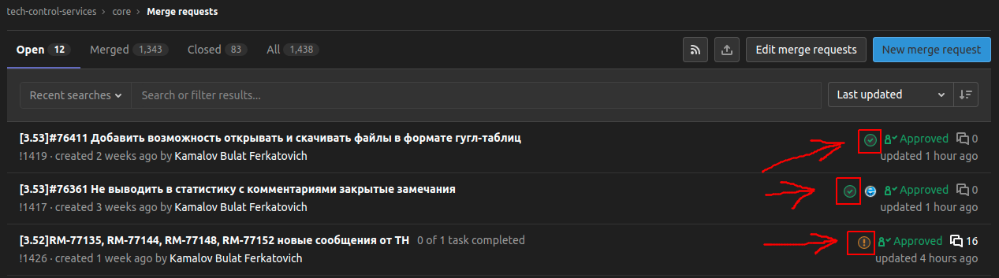
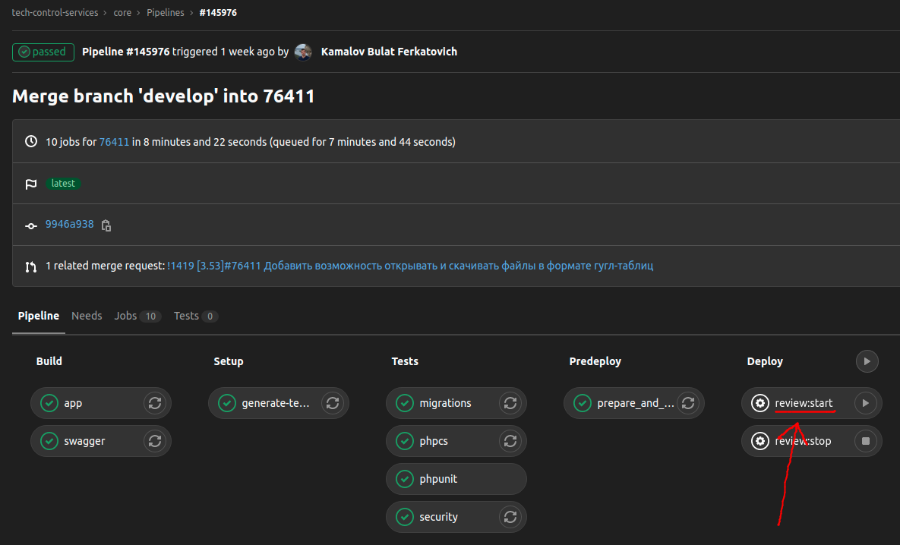
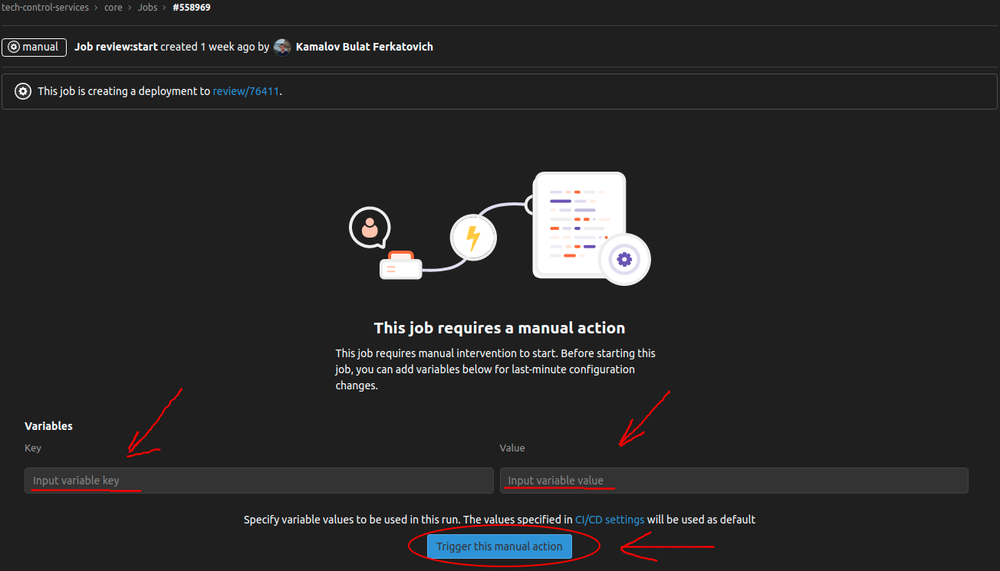
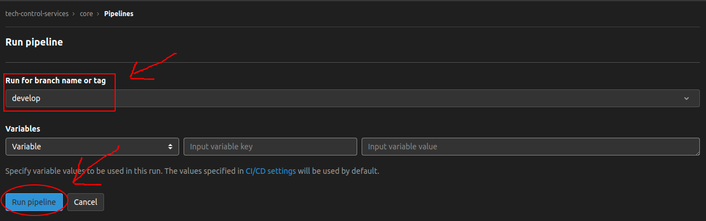
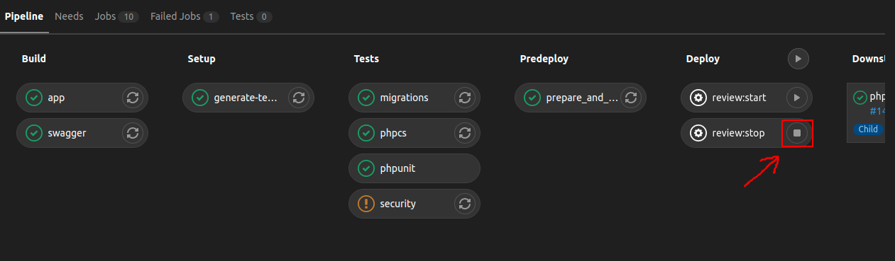

### Стенды

| feature стенды | test стенд | production |
| --- | --- | --- |
| https://номер_задачи.test.tracker.pik-digital.ru/api/v2/swagger/ | https://test.tracker.pik-digital.ru/api/v2/swagger/ | https://tracker.pik.ru/api/v2/swagger/ |

Для feature стендов в pipeline ветки можно передавать дополнительные настройки на шаге `review:start`.
Нужно перейти на страницу со списком [merge requests](https://git.pik.ru/tech-control-services/core/-/merge_requests) и,
чтобы перейти к `pipeline` задачи, нужно тыкнуть на кружочек, напротив МР задачи.

После чего на странице `pipeline` тыкнуть прямо на `review:start`.

На открытой странице заполняете поля `Key` и `Value`: в поле `Key` передается название переменной, а в поле `Value` передается
значение переменной. После чего тыкаете на кнопку `Trigger this manual action`.

Ниже в таблице перечислены все возможные настройки.

Если стенд уже запущен, то, чтобы передать новые значения параметров, нужно заново запустить pipeline, это делается тут
[ci/cd -> pipelines -> Run pipeline](https://git.pik.ru/tech-control-services/core/-/pipelines/new), где указывается
нужная ветка (обычно ветка = номеру задачи), потом нужно тыкнуть на кнопку `Run pipeline`.

После того как pipeline отработал, можно указать параметры в `review:start`, как описано ранее.

#### Все переменные feature стендов

| Переменная | Описание | Дефолт | Пример |
| --- | --- | --- | --- |
| `MASSTRANSIT_CONSUME_HANDLERS` | Названия слушателей через запятую (без пробелов) | На feature пусто, на остальных [все возможные слушатели](masstransit.md#все-возможные-слушатели) | `ExternalUserConsumeHandler,IssueAttachmentConsumeHandler` |
| `SEED` | Булево значение, если `true`, то очищает БД и накатывает сиды | На feature равно `true`, на остальных стендах сиды накатываются вручную | `false` |
| `CI_TEST_ROOMS` | Булево значение, если `true`, то при импорте объектов с `level = 5` поле `rooms` заполняется фейковыми комнатами | `false` | `false` |
| `RABBITMQ` | Булево значение, если `true`, то запускается rabbitmq consumer и publisher | На feature равно `false`, т.к. не во всех задачах нужна интеграция по шине rabbitmq | `true` |

### ВАЖНО: всегда удаляйте feature стенды после себя, если он больше не нужен, тк новые стенды могут не развернуться, из-за нехватки ресурсов
#### Как удалить стенд
Нужно перейти на страницу со списком [merge requests](https://git.pik.ru/tech-control-services/core/-/merge_requests) и,
чтобы перейти к `pipeline` задачи, нужно тыкнуть на кружочек, напротив МР задачи.

После чего на странице `pipeline` тыкнуть на значек остановки справа от `review:stop`.

